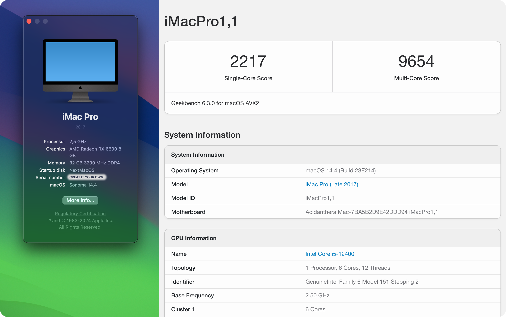

# OPENCORE EFI for GIGABYTE B660M DS3H and INTEL I5 12400 - Sonoma

### Specs:

- **CPU:** Intel Core i5 12400 (nonF)
- **Motherboard:** Gigabyte B660M DS3H DDR4
- **GPU:** MSI MECH RX 6600 8GB
- **RAM:** 4x Corsair Vengence LPX 8GB 3200Mhz
- **Audio:** Realtek ALC897 (default in mainboard)
- **LAN:** Realtek RTL8125 2.5GbE (default in mainboard)
- **Storage:**
    - WD NVME Black SN850 2TB (Mac)
    - WD NVME Blue SN570 500GB (Mac storage)
    - 2x WD Ultrastar HDD 16TB (Raid1)
- **Wireless:** Intel's AX210 Wi-Fi 6E
- **Monitor:**
    - LG 27QN600 27" IPS 2K
    - TomKo T2721Q 27" IPS 2K
- **Microphone:** MAONO AU-PM461TR
- **Headphone:** Blon BL-03

### Working:

- [x] CPU Power Management
- [x] Graphics Acceleration
- [x] Sleep/Wake
- [x] Ethernet
- [x] Audio (alcid=11)
- [x] USB
- [x] Wifi and Bluetooth
- [x] And almost everything else

### Not Working:
- Not detect any issues for now

### Some notes
I didn't build this EFI on my own. I just chose and built my hardware specs based on [one Reddit post](https://www.reddit.com/r/hackintosh/comments/u78vbx/triple_boot_moneterywindowsubuntu_on_i512400f/). 

**Update 1**: And then I updated the opencore and all kext versions through GUI with [this tool - OCAuxiliaryTools](https://github.com/ic005k/OCAuxiliaryTools).

**Update 2**: I also pick some variables from [another EFI - Sonoma](https://github.com/psabadac/GIGABYTE-B660M-DS3H-DDR4-i7-13700F-Hackintosh-OpenCore). To update to Sonoma.

**Update 3**: I added support for my wireless card Intel Ax210 following [this guide](https://github.com/perez987/Intel-AX210-wifi6-on-macOS-Sonoma).\
*`SecureBootModel` shouldn't stay `Disabled` or your PC would be **panic*** 